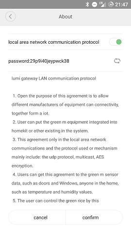
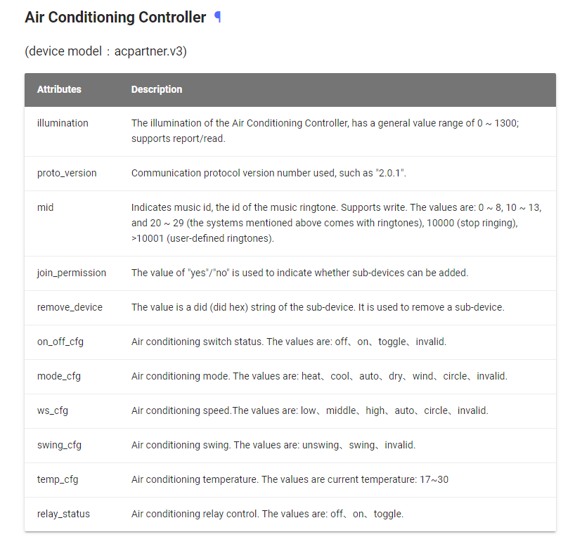
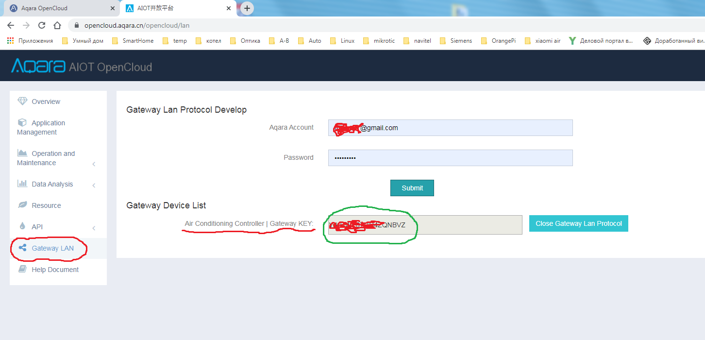
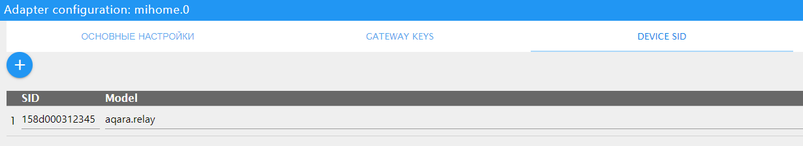

# mihome Gateway

  

**This adapter uses Sentry libraries to automatically report exceptions and code errors to the developers.** For more details and for information how to disable the error reporting see [Sentry-Plugin Documentation](https://github.com/ioBroker/plugin-sentry#plugin-sentry)! Sentry reporting is used starting with js-controller 3.0.

## Requirements
### Android (copied from [here](http://www.domoticz.com/wiki/Xiaomi_Gateway_(Aqara)) )
You first need to enable local network functions by using the Android Mi Home
App https://play.google.com/store/apps/details?id=com.xiaomi.smarthome :

- Install the App on a Android device
- Make sure you set your region to: `Mainland China` under `settings -> Locale` - at time of writing this seems to be required.
- Mainland China and language can set on English
- Select your Gateway in `Mi Home`
- Then the 3 dots at the top right of the screen
- Then click on about
- Tap the version (2.27 is the current Android version as of 2 June 2017) number at the bottom of the screen repeatedly
- You should see now 2 extra options listed in English (was Chinese in earlier versions) until you did now enable the developer mode. \[ if not try all steps again! \]
- Choose the first new option
- Then tap the first toggle switch to enable LAN functions. Note down the password (`29p9i40jeypwck38` in the screenshot). Make sure you hit the OK button (to the right of the cancel button) to save your changes.
- If you change here something, you lose your password!

### iOS
You first need to enable local network functions by using the [iOS Mi Home App iosApp Mi](https://itunes.apple.com/fr/app/%E7%B1%B3%E5%AE%B6-%E7%B2%BE%E5%93%81%E5%95%86%E5%9F%8E-%E6%99%BA%E8%83%BD%E7%94%9F%E6%B4%BB/id957323480?mt=8)
Install the App on a iOS device:
- Make sure you set your region to: `Mainland China` under `settings -> Locale` - required for the moment.
- `Mainland China` and language can set on English
- Select your Gateway in Mi Home
- Then the 3 dots at the top right of the screen
- Then click on about
- Tap under Tutorial menu(on the blank part) repeatedly
- You should see now 3 extra options listed in Chinese until you did now enable the developer mode. \[ if not try all steps again! \]
- Choose the second new option
- Then tap the first toggle switch to enable LAN functions. Note down the password (`29p9i40jeypwck38` in the screenshot). Make sure you hit the OK button (to the right of the cancel button) to save your changes.
- If you change here something, you lose your password!

### Using acpartner
  An adapter of version 1.3.xx or higher allows you to control the air conditioner connected to ioBroker using acpartner.v3 (KTBL11LM), 
(it will probably work with version v2 too, but the developer had not hardware to test it, if anyone tries, let us know).
  
The following states have been added to control the air conditioner:

  
The process of enabling LAN access and receiving GATEWAY KEY can be of some difficulty, the process is described below.
  
To start using:
- Install the Aqara Home application on your smartphone (https://play.google.com/store/apps/details?id=com.lumiunited.aqarahome),
- register in the Aqara Home application,
- select the "Mainland China" region in the settings,
- add acpartner to the Aqara Home app,
- update the acpartner firmware (click on the air conditioning icon, then the three dots in the upper right corner, then click the lowest point “Software Version”), as a result, Aqara firmware will be installed on acpartner (when using the MiHome application it was from Xiaomi),
- register on the site https://opencloud.aqara.cn/ with the same password and login as in the Aqara Home application (registration confirmation may take some time, I had about 6 hours),
- log in to the console https://opencloud.aqara.cn/console/
- create an application on the tab https://opencloud.aqara.cn/console/app-management with the type "Device access" (I’m not sure about the need for this item (because I did it yet), so you can try to skip it),
- then go to the console https://opencloud.aqara.cn/console and select Gateway LAN on the left, fill in the "Aqara account" and "Password" fields and click the Submit button - you will see your Air Conditioning Controller and the network protocol enable button by clicking to which you allow LAN access and you will see the network key, which is necessary to configure the adapter in ioBroker.
- in the adapter settings, enter the key obtained above.

## Usage
You can use small button on temperature sensor to trigger `double Press` event. Just press twice within 5 seconds. You can set this interval in settings, but do not set it over 10 seconds.

### Add device by SID
In case of device does not recognized by its Model name it is possible to try to add device using SID. Currently it is applicable for __Aqara 2 channels relay control module__ which has empty model name due to some problems in Gateway firmware.

In order to add device by SID, open `DEVICE SID` tab in adapter settings and specify SID and device name from the supported devices list below.

For Aqara relay module it should be specified like this:

### Supported devices

- `gateway` -           Xiaomi RGB Gateway
- `acpartner.v3` -      Aqara AC Partner (KTBL11LM)
- `sensor_ht` -         Xiaomi Temperature/Humidity
- `weather.v1` -        Xiaomi Temperature/Humidity/Pressure
- `switch` -            Xiaomi Wireless Switch
- `sensor_switch.aq2` - Xiaomi Aqara Wireless Switch Sensor
- `sensor_switch.aq3` - Xiaomi Aqara Wireless Switch Sensor
- `plug` -              Xiaomi Smart Plug
- `86plug` -            Xiaomi Smart Wall Plug
- `86sw2` -             Xiaomi Wireless Dual Wall Switch
- `86sw1` -             Xiaomi Wireless Single Wall Switch
- `natgas` -            Xiaomi Mijia Honeywell Gas Alarm Detector
- `smoke` -             Xiaomi Mijia Honeywell Fire Alarm Detector
- `ctrl_ln1` -          Xiaomi Aqara 86 Fire Wall Switch One Button
- `ctrl_ln1.aq1` -      Xiaomi Aqara Wall Switch LN
- `ctrl_ln2` -          Xiaomi 86 zero fire wall switch double key
- `ctrl_ln2.aq1` -      Xiaomi Aqara Wall Switch LN double key
- `ctrl_neutral2` -     Xiaomi Wired Dual Wall Switch
- `ctrl_neutral1` -     Xiaomi Wired Single Wall Switch
- `cube` -              Xiaomi Cube
- `sensor_cube.aqgl01` - Xiaomi Cube
- `magnet` -            Xiaomi Door Sensor
- `sensor_magnet.aq2` - Xiaomi Aqara Door Sensor
- `curtain` -           Xiaomi Aqara Smart Curtain
- `motion` -            Xiaomi Motion Sensor
- `sensor_motion.aq2` - Xiaomi Aqara Motion Sensor
- `sensor_wleak.aq1` -  Xiaomi Aqara water sensor
- `ctrl_ln2.aq1` -      Xiaomi Aqara Wall Switch LN (Double)
- `remote.b286acn01` -  Xiaomi Aqara Wireless Remote Switch (Double Rocker)
- `remote.b1acn01` -    Xiaomi Aqara Wireless Remote Switch
- `vibration` -         Xiaomi vibration Sensor
- `wleak1` -            Xiaomi Aqara Water Sensor
- `lock_aq1` -          Xiaomi Lock
- `relay.c2acn01` -     Aqara 2 channels relay control module (__using SID number__)

<!--
	Placeholder for the next version (at the beginning of the line):
	### __WORK IN PROGRESS__
-->
## Changelog

### 1.3.7 (2021-01-22)
* (Apollon77) Prevent crash case (Sentry IOBROKER-MIHOME-A)

### 1.3.6 (2020-09-25)
* (VLGorskij) Added new device QBKG24LM

### 1.3.5 (2020-09-17)
* (Apollon77) Fix crash cases (Sentry IOBROKER-MIHOME-1..4)

### 1.3.4 (2020-08-31)
* (Alan) Fixed the crash for non existing attributes 

### 1.3.3 (2020-08-26)
* (bluefox) Sentry is activated

### 1.3.2 (2020-08-25)
* (VLGorskij) Added ac-partner.v3 support
* (bluefox) Added compact mode

### 1.3.1 (2020-08-19)
* (Diginix) Fixed calculation for sensor's battery percentage

### 1.3.0 (2020-01-16)
* (algar42) Ability to add devices with missing model by their SID ([e.g. for Aqara two-channel relay](https://github.com/algar42/ioBroker.mihome#usage))

### 1.2.9 (2019-11-15)
* (Diginix) Fixed pressure range and values of Aqara weather sensor

### 1.2.8 (2019-07-18)
* (SchumyHao) Change curtain and gateway light role that making them can be detected by type-detector

### 1.2.7 (2019-06-25)
* (SchumyHao) Add several devices support for protocol 2.0.x

### 1.2.6 (2019-03-04)
* (Diginix) Improved calculation for sensor's battery percentage

### 1.2.5 (2019-01-24)
* (Vanwards) Added long click for Aquara wall switch

### 1.2.4 (2019-01-15)
* (SchumyHao) Add Chinese support

### 1.2.3 (2018-10-23)
* (goohnie) New wall switch was added

### 1.2.0 (2018-10-12)
* (bluefox) refactoring

### 1.1.2 (2018-10-08)
* (bluefox) New button switch was added

### 1.1.1 (2018-09-23)
* (bluefox) Fixed the creation of new devices

### 1.1.0 (2018-09-13)
* (bluefox) New devices added:  sensor_switch.aq3, ctrl_ln1.aq1, ctrl_ln2.aq1, sensor_cube.aqgl01, remote.b286acn01, vibration, wleak1, lock_aq1
* (bluefox) Names will be taken from gateway

### 1.0.7 (2018-06-25)
* (bluefox) The heartbeat timeout and the re-connection interval settings were added

### 1.0.6 (2018-05-26)
* (bluefox) Added new Aqara cube sensor

### 1.0.5 (2018-03-05)
* (bluefox) Xiaomi Aqara Wall Switch LN Double was added

### 1.0.4 (2018-01-21)
* (bluefox) The alarm state was fixed.

### 1.0.3 (2018-01-21)
* (bluefox) Invalid temperature values will be ignored

### 1.0.2 (2018-01-14)
* (bluefox) Ignore unknown state of sensors

### 1.0.0 (2018-01-05)
* (bluefox) Do not overwrite the names
* (bluefox) Ready for Admin3

### 0.3.3 (2017-11-26)
* (bluefox) Allow multiple mihome gateways

### 0.2.4 (2017-11-04)
* (bluefox) Add aqara water sensor

### 0.2.3 (2017-09-22)
* (bluefox) Remove "." from id of the device

### 0.2.2 (2017-08-01)
* (bluefox) Set after 300ms doublePress to false by Temperature Sensor\nAllow control of Plug

### 0.2.1 (2017-07-29)
* (bluefox) Implement double click on temperature sensor

### 0.2.0 (2017-07-18)
* (bluefox) fix battery level

### 0.1.4 (2017-06-09)
* (bluefox) add cube
* (bluefox) remove voltage by gateway

### 0.1.1 (2017-06-06)
* (bluefox) Initial commit

## License
MIT

Copyright (c) 2017-2020 bluefox <dogafox@gmail.com>
